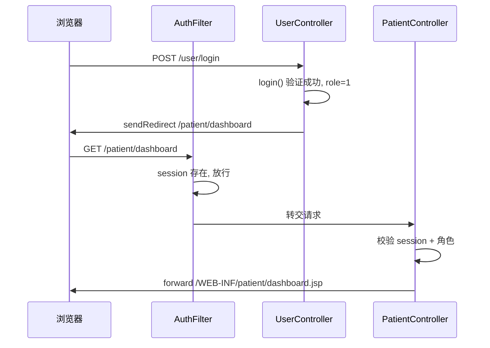

## 用户需求

登录后跳转到 `/patient/dashboard` 出现 404。根因是 `UserController.java` 登录成功后根据角色重定向到三个 Dashboard 路径，但项目中没有任何 Servlet 处理这些路径：

- `role=1` → `/patient/dashboard`（已有 JSP 但无 Servlet）
- `role=2` → `/staff/dashboard`（无 Servlet 也无 JSP）
- `role=3` → `/admin/dashboard`（无 Servlet 也无 JSP）

## 功能范围

- 创建 `PatientController`，映射 `/patient/dashboard`，含登录校验和角色校验（仅 role=1 可访问）
- 创建 `StaffController`，映射 `/staff/dashboard`，含登录校验和角色校验（仅 role=2 可访问）
- 创建 `AdminController`，映射 `/admin/dashboard`，含登录校验和角色校验（仅 role=3 可访问）
- 为 staff 和 admin 各创建一个占位 dashboard.jsp 页面（参考现有 patient/dashboard.jsp 的结构风格）
- 三个 Controller 均遵循与 `NotificationController` / `UserController` 相同的编码规范

## 核心特性

- 登录后不同角色自动跳转到各自的 Dashboard，不再出现 404
- 未登录直接访问 Dashboard URL 时，自动重定向到登录页（与现有 AuthFilter 配合，Controller 内再做一层 session 校验）
- 越权访问（如 patient 访问 staff/dashboard）时重定向回自己的 Dashboard

## 技术栈

- Java 21 + Jakarta Servlet 6.1 + JSP
- `@WebServlet` 注解方式（与现有项目保持一致，web.xml 无需修改）
- Maven WAR 项目，包名 `com.leese.cchcsystem`

## 实现思路

按照现有 `NotificationController` 的编码模式，为三个角色各自创建一个 Controller。每个 Controller 只处理 GET 请求（Dashboard 是只读展示页），校验 session 后 forward 到对应 JSP。同时在 Controller 内加一层**角色校验**，防止越权访问（AuthFilter 只校验是否登录，未校验角色）。

`staff/dashboard.jsp` 和 `admin/dashboard.jsp` 参考 `patient/dashboard.jsp` 的结构创建占位页面，保持样式一致，内容根据角色定制（staff 展示诊所管理入口，admin 展示系统管理入口）。

## 实现要点

- **路径对应关系**：
- `PatientController` → `@WebServlet("/patient/dashboard")` → forward 到 `/WEB-INF/patient/dashboard.jsp`
- `StaffController` → `@WebServlet("/staff/dashboard")` → forward 到 `/WEB-INF/staff/dashboard.jsp`（新建）
- `AdminController` → `@WebServlet("/admin/dashboard")` → forward 到 `/WEB-INF/admin/dashboard.jsp`（新建）
- **角色越权处理**：session 中 `role` 与 Controller 预期角色不符时，调用 `getDashboardUrl()` 等效逻辑重定向到对应的 Dashboard，避免直接暴露错误页
- **session 校验模式**：复用与 `UserController.showProfilePage()` / `NotificationController.showNotificationList()` 完全相同的 `session.getAttribute("userId") == null` 判断模式
- **JSP 放置在 WEB-INF 下**：与现有 `patient/dashboard.jsp` 位置一致，不可被直接访问，只能通过 Controller forward

## 架构说明



## 目录结构

```
src/main/java/com/leese/cchcsystem/controller/
├── UserController.java            # [不改动]
├── NotificationController.java    # [不改动]
├── PatientController.java         # [NEW] 映射 /patient/dashboard，校验 role=1，forward 到 patient/dashboard.jsp
├── StaffController.java           # [NEW] 映射 /staff/dashboard，校验 role=2，forward 到 staff/dashboard.jsp
└── AdminController.java           # [NEW] 映射 /admin/dashboard，校验 role=3，forward 到 admin/dashboard.jsp

src/main/webapp/WEB-INF/
├── patient/
│   └── dashboard.jsp              # [不改动] 已存在
├── staff/
│   └── dashboard.jsp              # [NEW] 员工 Dashboard 占位页面，样式与 patient/dashboard.jsp 一致，展示诊所管理入口
└── admin/
    └── dashboard.jsp              # [NEW] 管理员 Dashboard 占位页面，样式与 patient/dashboard.jsp 一致，展示系统管理入口
```